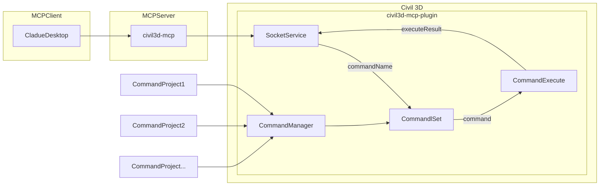

# civil3d-mcp

English

## Description

civil3d-mcp allows you to interact with Autodesk Civil 3D using the MCP protocol through MCP-supported clients (such as Claude, Cline, etc.).

This project is the server side (providing Tools to AI), and you need to use a Civil 3D MCP plugin (driving Civil 3D) in conjunction.

Join [Discord](https://discord.gg/cGzUGurq) | [QQ Group](http://qm.qq.com/cgi-bin/qm/qr?_wv=1027&k=kLnQiFVtYBytHm7R58KFoocd3mzU_9DR&authKey=fyXDOBmXP7FMkXAWjddWZumblxKJH7ZycYyLp40At3t9%2FOfSZyVO7zyYgIROgSHF&noverify=0&group_code=792379482)

## Features

- Allow AI to get data from the Civil 3D project
- Allow AI to drive Civil 3D to create, modify, and delete elements
- Send AI-generated code to Civil 3D to execute (may not be successful, successful rate is higher in some simple scenarios with clear requirements)

## Requirements

- nodejs 18+

> Complete installation environment still needs to consider the needs of the Civil 3D MCP plugin, please refer to its documentation.

## Installation

### 1. Build local MCP service

Install dependencies

```bash
npm install
```

Build

```bash
npm run build
```

### 2. Client configuration

**Claude client**

Claude client -> Settings > Developer > Edit Config > claude_desktop_config.json

```json
{
    "mcpServers": {
        "civil3d-mcp": {
            "command": "node",
            "args": ["<path to the built file>\\build\\index.js"]
        }
    }
}
```

Restart the Claude client. When you see the hammer icon, it means the connection to the MCP service is normal. (example shows Civil 3D, will be Civil 3D)


## Framework



## Supported Tools

| Name                               | Description                                                                                                |
| ---------------------------------- | ---------------------------------------------------------------------------------------------------------- |
| `get_drawing_info`                 | Retrieves basic information about the active Civil 3D drawing.                                             |
| `list_civil_object_types`          | Lists major Civil 3D object types available or present in the current drawing (e.g., Alignments, Surfaces). |
| `get_selected_civil_objects_info`  | Gets basic properties of currently selected Civil 3D objects. Can limit the number of returned objects.    |
| `civil3d_health`                   | Reports the status of the Civil 3D connection and plugin.                                                  |
| `civil3d_drawing`                  | Manages the active drawing (info/settings/save/undo/redo) and supports creating a new drawing from a template. |
| `civil3d_job`                      | Checks the status of long-running asynchronous Civil 3D operations or requests cancellation.               |
| `create_cogo_point`                | Creates a new COGO (Coordinate Geometry) point in the Civil 3D drawing.                                    |
| `create_line_segment`              | Creates a simple line segment in the Civil 3D drawing.                                                     |
| `civil3d_point`                    | Reads, creates, imports, and deletes Civil 3D COGO points and point groups.                                |
| `civil3d_alignment`                | Reads Civil 3D horizontal alignments, converts stationing, and supports create/delete operations.          |
| `civil3d_profile`                  | Reads Civil 3D vertical profiles and supports creation and deletion of profiles.                           |
| `civil3d_surface`                  | Reads Civil 3D surface data and supports create/delete operations.                                         |
| `civil3d_surface_edit`             | Modifies Civil 3D surface data (add points/breaklines/boundaries, extract contours, compute volumes).      |
| `civil3d_corridor`                 | Reads Civil 3D corridor data and controls corridor rebuild and volume operations.                          |
| `civil3d_section`                  | Reads Civil 3D section data and supports sample line creation.                                             |
| `civil3d_feature_line`             | Reads Civil 3D feature lines and supports exporting them as 3D polylines.                                  |
| `civil3d_style`                    | Lists and inspects Civil 3D styles for supported object types.                                             |
| `civil3d_label`                    | Manages labels on Civil 3D objects.                                                                        |
| `civil3d_coordinate_system`        | Provides coordinate system information and performs coordinate transformations.                            |
| `civil3d_data_shortcut`            | Manages Civil 3D data shortcuts including listing, syncing, and creating references.                       |
| `civil3d_parcel`                   | Reads Civil 3D parcel and site data.                                                                       |
| `civil3d_pipe_network`             | Reads Civil 3D pipe network data including networks, pipes, structures, and interference checks.           |
| `civil3d_pipe_network_edit`        | Creates and modifies Civil 3D pipe networks, pipes, and structures.                                        |
| `civil3d_assembly`                 | Lists and inspects Civil 3D assemblies and their subassemblies.                                            |
| `acad_create_polyline`             | Creates an AutoCAD 2D polyline in model space.                                                             |
| `acad_create_3dpolyline`           | Creates an AutoCAD 3D polyline in model space.                                                             |
| `acad_create_text`                 | Creates AutoCAD DBText in model space.                                                                     |
| `acad_create_mtext`                | Creates AutoCAD MText in model space.                                                                      |
