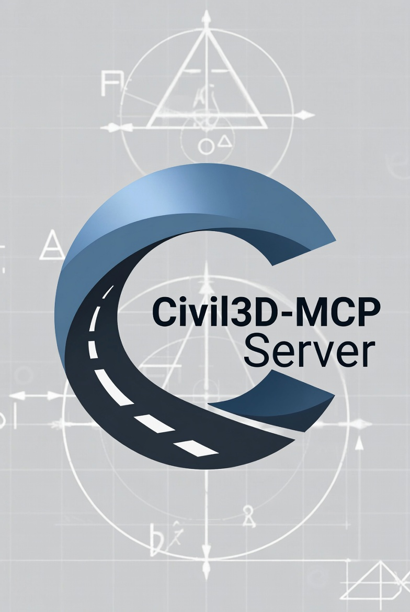
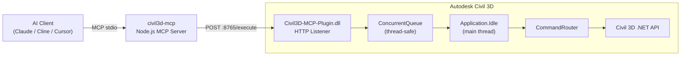

<div align="center">
  

  <h1>Civil3D-MCP Server</h1>

  <p><strong>Connect Claude, Cursor, Cline, and other MCP clients directly to a live Autodesk Civil 3D drawing.</strong></p>
  <p>Node.js MCP server + native Civil 3D plugin + workflow automation for grading, hydrology, plan production, QC, and data shortcuts.</p>

  [](https://nodejs.org)
  [](https://www.typescriptlang.org)
  [](./LICENSE)
  [](https://modelcontextprotocol.io)
  [](https://www.autodesk.com/products/civil-3d)
  [](https://github.com/Sacred-G/Civil3D-mcp/issues)

  <p>
    <a href="#quick-start">Quick Start</a> •
    <a href="#installation">Installation</a> •
    <a href="./docs/DEPLOYMENT.md">Deployment</a> •
    <a href="./docs/tools.md">Tool Reference</a>
  </p>

</div>

---

## What Is This?

**Civil3D-MCP** bridges AI assistants (Claude, Cline, Cursor, etc.) to a **live, open Civil 3D drawing** using the [Model Context Protocol](https://modelcontextprotocol.io). Give Claude your design brief — it reads your drawing, runs calculations, and makes changes in real time.

```
AI Client  ↔  civil3d-mcp (Node.js / stdio)  ↔  HTTP :8765  ↔  Civil3D-MCP-Plugin.dll (inside Civil 3D)
```

This is the **MCP server** (TypeScript). You also need the **Civil 3D .NET plugin** — see [Installation](#installation).

### What Changed Recently

- Native workflow handlers now cover major QC, grading, hydrology, plan-production, and data-shortcut flows instead of relying only on client-side orchestration.
- Claude Code can now be registered with a single project-scoped command that installs dependencies, builds the Node server, and writes the repo `.mcp.json` entry.
- Repository-generated tool inventories live in [`output_repo_tools`](./output_repo_tools), making it easier to audit what is already implemented versus what still belongs on the roadmap.

---

## Quick Start

If you want the fastest path from clone to a working Claude + Civil 3D setup on Windows:

1. Clone and build the Node side:

   ```bash
   git clone https://github.com/Sacred-G/Civil3D-mcp.git
   cd Civil3D-mcp
   npm install
   npm run build
   ```

2. Build and `NETLOAD` the Civil 3D plugin:

   ```powershell
   dotnet build .\Civil3D-MCP-Plugin\Civil3DMcpPlugin.csproj -c Release
   ```

3. Register Claude Code for this repo:

   ```powershell
   npm run claude:add
   ```

4. Open Civil 3D, load the plugin, and start asking for real work:
   - "Audit this drawing before design starts."
   - "Create a grading surface from this feature line."
   - "Delineate the watershed and estimate runoff."
   - "Publish the plan/profile sheets to PDF."

---

## Features

- **180+ MCP tools** covering the complete Civil 3D design workflow
- **Native workflow execution** for corridor QC, surface comparison, project startup, grading conversion, plan publish, data shortcuts, and hydrology pipelines
- **Full road design pipeline** — alignments, profiles, corridors, cross-sections, superelevation
- **Surface analysis** — elevation bands, slope distribution, aspect, watershed, cut/fill volumes
- **Pipe & pressure network** design, validation, and hydraulic analysis
- **Plan production** — sheet sets, Plan/Profile sheets, PDF export
- **QC checks** — alignment, profile, corridor, surface, pipe network, drawing standards
- **Quantity takeoff** — earthwork, corridor materials, pipe lengths, parcel areas, CSV export
- **Cost estimation** — pay items, material costs, construction estimates
- **Hydrology** — flow path tracing, watershed delineation, Rational Method runoff, time of concentration
- **Grading** — feature lines, grading groups, grading criteria, surface generation
- **COGO/Survey** — inverse, traverse, curve solve, survey figures, LandXML import
- **Storm & Sanitary Analysis (SSA)** integration and detention basin sizing
- **Intersection design** and corridor target mapping
- **Sight distance** calculations and AASHTO stopping sight distance checks
- **Assembly/subassembly** creation and editing

---

## Architecture



> **Why `Application.Idle`?** Civil 3D (like Blender) requires all database operations on the main thread. The plugin queues incoming HTTP requests and drains the queue on the main thread's idle event — giving full, safe access to the Civil 3D .NET API.

---

## Requirements

| Component | Version |
|---|---|
| Node.js | 18+ |
| Civil 3D | 2023, 2024, 2025, or 2026 |
| .NET SDK | 8.0 |
| Civil 3D API refs | Local DLLs in `C_References/` |
| Visual Studio | 2022 recommended |

---

## Installation

### 1 — Build the MCP Server (TypeScript)

```bash
git clone https://github.com/Sacred-G/Civil3D-mcp.git
cd Civil3D-mcp
npm install
npm run build
```

### 1.5 — One-Line Claude Code Setup

From the repo root on Windows, this project-scoped command adds the MCP server to Claude Code and creates the repo `.mcp.json` entry automatically:

```powershell
claude mcp add --scope project --transport stdio civil3d-mcp -- powershell -NoProfile -ExecutionPolicy Bypass -File "$PWD\scripts\claude-bootstrap-and-run.ps1"
```

The registered launcher will automatically install npm dependencies and build the Node server the first time Claude starts it.

If you want a wrapper that does the install, build, and `claude mcp add` step for you immediately, run:

```powershell
npm run claude:add
```

Useful variants:

```powershell
npm run claude:add:user
npm run claude:print-add
```

### 2 — Build & Load the C# Plugin

**Prerequisites:** Civil 3D 2023+, .NET 8 SDK, and local Civil 3D API assemblies copied into `C_References/`

```powershell
dotnet build .\Civil3D-MCP-Plugin\Civil3DMcpPlugin.csproj -c Release
# Output: Civil3D-MCP-Plugin\bin\Release\net8.0-windows\Civil3DMcpPlugin.dll
```

The plugin project resolves Autodesk references from [`C_References`](./C_References). At minimum, make sure these local DLLs are present:

```text
accoremgd.dll
AcDbMgd.dll
acmgd.dll
AecBaseMgd.dll
AeccDbMgd.dll
```

**Load into Civil 3D:**

| Method | Steps |
|---|---|
| **Manual (NETLOAD)** | Open Civil 3D → type `NETLOAD` → browse to `Civil3D-MCP-Plugin.dll` |
| **Autoload (recommended)** | Add registry key — see [DEPLOYMENT.md](./docs/DEPLOYMENT.md) |

Once loaded, three commands are available in the Civil 3D command line:

| Command | Description |
|---|---|
| `MCPSTART` | Start the HTTP server (auto-starts on load) |
| `MCPSTOP` | Stop the HTTP server |
| `MCPSTATUS` | Show server status and port |

### 3 — Configure Your AI Client

**Recommended for Claude Code**

```powershell
npm run claude:add
```

That command registers the bootstrap launcher in Claude Code and keeps the repo self-contained. Use `npm run claude:print-add` if you want to inspect the exact `claude mcp add` command without modifying config.

**Claude Desktop** — `claude_desktop_config.json`:

```json
{
  "mcpServers": {
    "civil3d-mcp": {
      "command": "node",
      "args": ["C:/path/to/Civil3D-mcp/build/index.js"]
    }
  }
}
```

**Claude Code** — add via CLI:

```powershell
claude mcp add --scope project --transport stdio civil3d-mcp -- powershell -NoProfile -ExecutionPolicy Bypass -File "$PWD\scripts\claude-bootstrap-and-run.ps1"
```

Restart your client. When you see the **hammer icon**, the MCP connection is live.

> For Docker, npm publishing, environment variables, and alternate deployment paths see **[docs/DEPLOYMENT.md](./docs/DEPLOYMENT.md)**.

---

## Example Conversations

> *"What alignments are in this drawing and how long is each one?"*
> → `civil3d_alignment` → returns names, station ranges, lengths

> *"Run a full QC check on the corridor and give me a report."*
> → `civil3d_workflow_corridor_qc_report` → checks targets, regions, rebuild errors, exports report

> *"Trace the flow path from coordinate (5000, 3200) and estimate the peak runoff using the Rational Method."*
> → `civil3d_hydrology_watershed_runoff_workflow` → delineates watershed, calculates Q=CiA

> *"Create a Plan/Profile sheet set for alignment 'Mainline' and export to PDF."*
> → `civil3d_plan_profile_sheet_create` → `civil3d_workflow_plan_production_publish`

> *"Size the storm drain network for a 10-year storm and check all pipe velocities."*
> → `civil3d_pipe_network_size` → `civil3d_pipe_network_hydraulics`

> *"Calculate cut/fill volumes between the existing ground and proposed surface."*
> → `civil3d_surface_volume_calculate` → `civil3d_surface_volume_report`

---

## Tool Reference (180+ tools)

<details>
<summary><strong>Drawing Info & Context (7 tools)</strong></summary>

| Tool | Description |
|------|-------------|
| `get_drawing_info` | Retrieves basic information about the active Civil 3D drawing |
| `list_civil_object_types` | Lists major Civil 3D object types present in the current drawing |
| `get_selected_civil_objects_info` | Gets properties of currently selected Civil 3D objects |
| `civil3d_health` | Reports Civil 3D connection and plugin status |
| `civil3d_drawing` | Manages drawing state, document info, save/undo operations |
| `civil3d_job` | Checks status of long-running async operations or requests cancellation |
| `list_tool_capabilities` | Lists domain and capability metadata for the full MCP tool catalog |

</details>

<details>
<summary><strong>Drawing Primitives (6 tools)</strong></summary>

| Tool | Description |
|------|-------------|
| `create_cogo_point` | Creates a single COGO point |
| `create_line_segment` | Creates a simple line segment |
| `acad_create_polyline` | Creates an AutoCAD 2D polyline in model space |
| `acad_create_3dpolyline` | Creates an AutoCAD 3D polyline in model space |
| `acad_create_text` | Creates AutoCAD DBText in model space |
| `acad_create_mtext` | Creates AutoCAD MText in model space |

</details>

<details>
<summary><strong>Alignment (10 tools)</strong></summary>

| Tool | Description |
|------|-------------|
| `civil3d_alignment` | Reads alignments, converts stationing, create/delete |
| `civil3d_alignment_report` | Builds structured alignment geometry report |
| `civil3d_alignment_get_station_offset` | Returns station/offset of an XY point relative to an alignment |
| `civil3d_alignment_add_tangent` | Appends a fixed tangent entity to an alignment |
| `civil3d_alignment_add_curve` | Appends a fixed horizontal curve to an alignment |
| `civil3d_alignment_add_spiral` | Appends a spiral (transition curve) to an alignment |
| `civil3d_alignment_delete_entity` | Deletes a tangent/curve/spiral entity by index |
| `civil3d_alignment_offset_create` | Creates a new offset alignment at a constant distance |
| `civil3d_alignment_set_station_equation` | Adds a station equation to an alignment |
| `civil3d_alignment_widen_transition` | Creates a variable-offset widening/narrowing transition region |

</details>

<details>
<summary><strong>Profile (10 tools)</strong></summary>

| Tool | Description |
|------|-------------|
| `civil3d_profile` | Reads profiles, create/delete |
| `civil3d_profile_report` | Builds structured profile report with station/elevation sampling |
| `civil3d_profile_get_elevation` | Samples elevation and grade at a given station |
| `civil3d_profile_add_pvi` | Adds a PVI to a layout profile |
| `civil3d_profile_add_curve` | Adds a parabolic vertical curve at an existing PVI |
| `civil3d_profile_delete_pvi` | Deletes the PVI nearest to a specified station |
| `civil3d_profile_set_grade` | Sets the grade of a tangent entity |
| `civil3d_profile_check_k_values` | Validates K-values against AASHTO minimums for design speed |
| `civil3d_profile_view_create` | Creates a profile view at a specified insertion point |
| `civil3d_profile_view_band_set` | Applies a band set style to an existing profile view |

</details>

<details>
<summary><strong>Superelevation (4 tools)</strong></summary>

| Tool | Description |
|------|-------------|
| `civil3d_superelevation_get` | Retrieve superelevation design data for an alignment |
| `civil3d_superelevation_set` | Apply superelevation using AASHTO attainment method |
| `civil3d_superelevation_design_check` | Validate max superelevation rates and attainment lengths |
| `civil3d_superelevation_report` | Generate formatted superelevation report |

</details>

<details>
<summary><strong>Surface (15 tools)</strong></summary>

| Tool | Description |
|------|-------------|
| `civil3d_surface` | Reads surface data, create/delete |
| `civil3d_surface_edit` | Modifies surface data: points, breaklines, boundaries, contours |
| `civil3d_surface_statistics_get` | Comprehensive statistics: elevation range, area, point/triangle count |
| `civil3d_surface_contour_interval_set` | Set minor and major contour display intervals |
| `civil3d_surface_sample_elevations` | Sample elevations at grid points, discrete points, or transect |
| `civil3d_surface_analyze_elevation` | Elevation band distribution (area and percentage per band) |
| `civil3d_surface_analyze_slope` | Slope distribution (area and percentage per slope range) |
| `civil3d_surface_analyze_directions` | Aspect/facing direction breakdown by cardinal sectors |
| `civil3d_surface_volume_calculate` | Calculate cut/fill volumes between two surfaces |
| `civil3d_surface_volume_by_region` | Cut/fill volumes within a polygon region |
| `civil3d_surface_volume_report` | Formatted human-readable cut/fill volume report |
| `civil3d_surface_comparison_workflow` | Structured two-surface comparison with cut/fill volumes |
| `civil3d_surface_create_from_dem` | Create TIN surface from DEM file (.dem, .tif, .asc, .flt) |
| `civil3d_surface_watershed_add` | Add watershed analysis: drainage basins and flow paths |
| `civil3d_surface_drainage_workflow` | Surface drainage workflow: flow path, elevation sampling, runoff estimate |

</details>

<details>
<summary><strong>Corridor (6 tools)</strong></summary>

| Tool | Description |
|------|-------------|
| `civil3d_corridor` | Reads corridor data, rebuild, volume operations |
| `civil3d_corridor_summary` | Builds corridor summary with surfaces and volume analysis |
| `civil3d_corridor_target_mapping_get` | Retrieve subassembly target mappings for a corridor |
| `civil3d_corridor_target_mapping_set` | Set/update subassembly target mappings (surfaces, alignments, profiles) |
| `civil3d_corridor_region_add` | Add a new region to a corridor baseline |
| `civil3d_corridor_region_delete` | Delete a region from a corridor baseline |

</details>

<details>
<summary><strong>Sections & Section Views (6 tools)</strong></summary>

| Tool | Description |
|------|-------------|
| `civil3d_section` | Reads section data, sample line creation |
| `civil3d_section_view_create` | Create section views for a sample line group |
| `civil3d_section_view_list` | List section views in the drawing |
| `civil3d_section_view_update_style` | Update display/band set style on existing section views |
| `civil3d_section_view_group_create` | Create a multi-row grid layout of section views |
| `civil3d_section_view_export` | Export section data to CSV/text (offsets, elevations, materials) |

</details>

<details>
<summary><strong>Intersection Design (3 tools)</strong></summary>

| Tool | Description |
|------|-------------|
| `civil3d_intersection_list` | List all intersections in the drawing |
| `civil3d_intersection_create` | Create an intersection between two road alignments |
| `civil3d_intersection_get` | Get detailed properties of an intersection |

</details>

<details>
<summary><strong>Grading & Feature Lines (14 tools)</strong></summary>

| Tool | Description |
|------|-------------|
| `civil3d_grading` | Canonical grading domain tool for groups, gradings, criteria, and feature-line actions |
| `civil3d_feature_line` | Reads feature lines and exports them as 3D polylines |
| `civil3d_feature_line_create` | Create a new feature line from 3D points |
| `civil3d_grading_group_list` | List all grading groups in the drawing |
| `civil3d_grading_group_create` | Create a new grading group |
| `civil3d_grading_group_get` | Get detailed info about a grading group |
| `civil3d_grading_group_delete` | Delete a grading group and all its gradings |
| `civil3d_grading_group_volume` | Get cut/fill volume report for a grading group |
| `civil3d_grading_group_surface_create` | Create a surface from a grading group |
| `civil3d_grading_criteria_list` | List all available grading criteria sets |
| `civil3d_grading_list` | List all grading objects within a grading group |
| `civil3d_grading_create` | Create a new grading from a feature line |
| `civil3d_grading_get` | Get detailed properties of a grading object |
| `civil3d_grading_delete` | Delete a grading object by handle |

</details>

<details>
<summary><strong>Points & Point Groups (6 tools)</strong></summary>

| Tool | Description |
|------|-------------|
| `civil3d_point` | Reads, creates, imports, deletes COGO points and point groups |
| `civil3d_point_export` | Export COGO points to text/CSV (PNEZD, PENZ, XYZD, XYZ, CSV) |
| `civil3d_point_transform` | Transform points by translation, rotation, and/or scale |
| `civil3d_point_group_create` | Create a new point group with filter criteria |
| `civil3d_point_group_update` | Update filter criteria and description of a point group |
| `civil3d_point_group_delete` | Delete a point group (points are NOT deleted) |

</details>

<details>
<summary><strong>COGO & Survey (9 tools)</strong></summary>

| Tool | Description |
|------|-------------|
| `civil3d_cogo_inverse` | Calculate bearing and distance between two coordinate pairs |
| `civil3d_cogo_direction_distance` | Project a point from start coordinate given bearing and distance |
| `civil3d_cogo_curve_solve` | Solve a horizontal curve given any two curve elements |
| `civil3d_cogo_traverse` | Solve a traverse from start point through bearing/distance courses |
| `civil3d_coordinate_system` | Coordinate system info and coordinate transformations |
| `civil3d_survey_database_list` | List all survey databases |
| `civil3d_survey_database_create` | Create a new survey database |
| `civil3d_survey_figure_list` | List all survey figures |
| `civil3d_survey_figure_get` | Get 3D vertex data for a specific survey figure |

</details>

<details>
<summary><strong>Pipe Networks — Gravity (3 tools)</strong></summary>

| Tool | Description |
|------|-------------|
| `civil3d_pipe_catalog` | Lists available pipe parts lists and part names |
| `civil3d_pipe_network` | Reads pipe network data: networks, pipes, structures |
| `civil3d_pipe_network_edit` | Creates and modifies pipe networks, pipes, and structures |

</details>

<details>
<summary><strong>Pressure Networks (15 tools)</strong></summary>

| Tool | Description |
|------|-------------|
| `civil3d_pressure_network_list` | List all pressure networks |
| `civil3d_pressure_network_create` | Create a new pressure network |
| `civil3d_pressure_network_get_info` | Get detailed info about a pressure network |
| `civil3d_pressure_network_delete` | Delete a pressure network and all components |
| `civil3d_pressure_network_assign_parts_list` | Assign a parts list to a network |
| `civil3d_pressure_network_set_cover` | Set minimum cover depth for pipes in a network |
| `civil3d_pressure_network_validate` | Validate a network for cover violations and disconnections |
| `civil3d_pressure_network_export` | Export pressure network data as structured JSON |
| `civil3d_pressure_network_connect` | Connect two pressure networks by merging |
| `civil3d_pressure_pipe_add` | Add a pressure pipe segment |
| `civil3d_pressure_pipe_get_properties` | Get properties of a pressure pipe |
| `civil3d_pressure_pipe_resize` | Change pressure pipe size to a different catalog entry |
| `civil3d_pressure_fitting_add` | Add a pressure fitting (elbow, tee, reducer, cap) |
| `civil3d_pressure_fitting_get_properties` | Get properties of a pressure fitting |
| `civil3d_pressure_appurtenance_add` | Add a pressure appurtenance (valve, hydrant, meter) |

</details>

<details>
<summary><strong>Plan Production / Sheets (12 tools)</strong></summary>

| Tool | Description |
|------|-------------|
| `civil3d_sheet_set_list` | List all Plan Production sheet sets |
| `civil3d_sheet_set_create` | Create a new Plan Production sheet set |
| `civil3d_sheet_set_get_info` | Get detailed info about a sheet set |
| `civil3d_sheet_set_export` | Export all sheets to a multi-page PDF |
| `civil3d_sheet_set_title_block` | Set or update title block template on a sheet |
| `civil3d_sheet_add` | Add a new sheet to an existing sheet set |
| `civil3d_sheet_get_properties` | Get full properties of a specific sheet |
| `civil3d_sheet_publish_pdf` | Publish sheet layouts to a PDF file |
| `civil3d_sheet_view_create` | Create a viewport/view on a sheet layout |
| `civil3d_sheet_view_set_scale` | Update the scale of a viewport |
| `civil3d_plan_profile_sheet_create` | Create a Plan/Profile sheet for an alignment and profile |
| `civil3d_plan_profile_sheet_update_alignment` | Update alignment and/or profile on an existing sheet |

</details>

<details>
<summary><strong>QC Checks (8 tools)</strong></summary>

| Tool | Description |
|------|-------------|
| `civil3d_qc_check_alignment` | QC alignment: tangent lengths, curve radii, spirals, design-speed compliance |
| `civil3d_qc_check_profile` | QC profile: max grade, K-values, sight distance requirements |
| `civil3d_qc_check_corridor` | QC corridor: invalid regions, missing targets, assembly gaps, rebuild errors |
| `civil3d_qc_check_pipe_network` | QC pipe network: cover depth, slope, velocity, connectivity |
| `civil3d_qc_check_surface` | QC TIN surface: elevation spikes, flat triangles, crossing breaklines |
| `civil3d_qc_check_labels` | Check labels for missing labels and style standard violations |
| `civil3d_qc_check_drawing_standards` | Audit drawing: layer naming, lineweights, colors |
| `civil3d_qc_report_generate` | Run full QC pass and write consolidated report to disk |

</details>

<details>
<summary><strong>Workflow Automation (14 tools)</strong></summary>

| Tool | Description |
|------|-------------|
| `civil3d_workflow` | Canonical workflow tool for multi-step QC, grading, pipe-design, standards, and publishing |
| `civil3d_workflow_corridor_qc_report` | Run corridor QC and optionally generate a consolidated QC report |
| `civil3d_workflow_grading_surface_volume` | Calculate grading cut/fill volume between base and comparison surfaces |
| `civil3d_workflow_surface_comparison_report` | Run a structured surface comparison and follow it with a volume report |
| `civil3d_workflow_data_shortcut_publish_sync` | Publish a data shortcut and immediately synchronize it |
| `civil3d_workflow_data_shortcut_reference_sync` | Reference a project data shortcut and immediately synchronize it |
| `civil3d_workflow_project_startup` | Check Civil 3D health, inspect drawing readiness, and optionally create/save a startup drawing |
| `civil3d_workflow_project_reference_setup` | Reference one or more project data shortcuts, sync them, and optionally save |
| `civil3d_workflow_drawing_readiness_audit` | Check health, drawing state, selection context, and standards readiness in one audit |
| `civil3d_workflow_feature_line_to_grading` | Convert a feature line into grading and optionally create a grading surface |
| `civil3d_workflow_pipe_network_design` | Size a gravity pipe network and optionally run hydraulic analysis |
| `civil3d_workflow_plan_production_publish` | Publish a sheet set or explicit layout list to PDF output |
| `civil3d_workflow_qc_fix_and_verify` | Audit drawing standards, apply fixes, and verify the result |
| `civil3d_workflow_survey_import_adjust_figures` | Import survey LandXML, optionally adjust a network, and review resulting figures |

</details>

<details>
<summary><strong>Quantity Takeoff (10 tools)</strong></summary>

| Tool | Description |
|------|-------------|
| `civil3d_qty_surface_volume` | Cut/fill volumes between surfaces (with corridor or region scope) |
| `civil3d_qty_earthwork_summary` | Running earthwork cut/fill summary table |
| `civil3d_qty_corridor_volumes` | Subassembly material volumes by region for a corridor |
| `civil3d_qty_material_list_get` | Retrieve material list defined on a corridor |
| `civil3d_qty_pipe_network_lengths` | Total pipe lengths for a gravity pipe network |
| `civil3d_qty_pressure_network_lengths` | Total pipe lengths for a pressure network |
| `civil3d_qty_alignment_lengths` | Total length for one or more alignments |
| `civil3d_qty_parcel_areas` | Area, perimeter, and address data for parcels |
| `civil3d_qty_point_count_by_group` | Count COGO points per point group |
| `civil3d_qty_export_to_csv` | Export consolidated quantity takeoff report to CSV |

</details>

<details>
<summary><strong>Hydrology (7 tools)</strong></summary>

| Tool | Description |
|------|-------------|
| `civil3d_hydrology` | Canonical hydrology tool for surface drainage, catchments, Tc, SSA, and multi-step workflows |
| `civil3d_catchment` | Manages catchments and catchment groups, including properties, flow paths, and boundaries |
| `civil3d_time_of_concentration` | Calculates Tc using supported methods and generates hydrographs |
| `civil3d_stm` | Exports/imports STM files and opens Storm and Sanitary Analysis |
| `civil3d_hydrology_watershed_runoff_workflow` | Runs low-point or outlet-based watershed delineation through runoff estimation |
| `civil3d_hydrology_runoff_detention_workflow` | Runs runoff estimation through detention sizing and optional stage-storage output |
| `civil3d_hydrology_runoff_pipe_workflow` | Runs runoff estimation through gravity pipe HGL and hydraulic analysis |

</details>

<details>
<summary><strong>Pipe Hydraulics (3 tools)</strong></summary>

| Tool | Description |
|------|-------------|
| `civil3d_pipe_network_hgl` | Calculate Hydraulic Grade Line (HGL) for gravity pipe networks |
| `civil3d_pipe_network_hydraulics` | Perform full hydraulic capacity analysis on pipe networks |
| `civil3d_pipe_structure_properties` | Retrieve detailed properties of individual pipe structures |

</details>

<details>
<summary><strong>Pipe Design Automation (2 tools)</strong></summary>

| Tool | Description |
|------|-------------|
| `civil3d_pipe_network_size` | Size gravity-network pipes from Manning full-flow capacity with catalog part selection |
| `civil3d_pipe_profile_view_automation` | Automate gravity-pipe profile-view setup with EG profile creation |

</details>

<details>
<summary><strong>Assembly Creation (3 tools)</strong></summary>

| Tool | Description |
|------|-------------|
| `civil3d_assembly_create` | Create a new Civil 3D assembly at a specified model-space location |
| `civil3d_subassembly_create` | Add a subassembly from the Civil 3D catalog to an existing assembly |
| `civil3d_assembly_edit` | Inspect or modify an existing Civil 3D assembly (list, update, delete subassemblies) |

</details>

<details>
<summary><strong>Sight Distance (2 tools)</strong></summary>

| Tool | Description |
|------|-------------|
| `civil3d_sight_distance_calculate` | Calculate AASHTO stopping, passing, or decision sight distance for design speed |
| `civil3d_stopping_distance_check` | Check stopping sight distance compliance along an alignment at station intervals |

</details>

<details>
<summary><strong>Detention & Stormwater (2 tools)</strong></summary>

| Tool | Description |
|------|-------------|
| `civil3d_detention_basin_size_calculate` | Size a detention basin to reduce peak stormwater runoff |
| `civil3d_detention_stage_storage` | Generate stage-storage-discharge table for a detention basin surface |

</details>

<details>
<summary><strong>Slope Analysis (2 tools)</strong></summary>

| Tool | Description |
|------|-------------|
| `civil3d_slope_geometry_calculate` | Calculate daylight line coordinates and slope geometry for cut/fill sections |
| `civil3d_slope_stability_check` | Evaluate cut and fill slope stability along an alignment |

</details>

<details>
<summary><strong>Cost Estimation (2 tools)</strong></summary>

| Tool | Description |
|------|-------------|
| `civil3d_pay_items_export` | Extract Civil 3D quantities and export as structured pay item schedule to CSV/Excel |
| `civil3d_material_cost_estimate` | Generate construction cost estimate by combining quantities with unit prices |

</details>

<details>
<summary><strong>Survey Processing (4 tools)</strong></summary>

| Tool | Description |
|------|-------------|
| `civil3d_survey_observation_list` | List survey observations from a survey database |
| `civil3d_survey_network_adjust` | Adjust survey networks (least squares, compass, transit, crandall) |
| `civil3d_survey_figure_create` | Create survey figures from point numbers |
| `civil3d_survey_landxml_import` | Import survey data from LandXML files |

</details>

<details>
<summary><strong>Data Shortcuts (4 tools)</strong></summary>

| Tool | Description |
|------|-------------|
| `civil3d_data_shortcut_create` | Create data shortcuts for Civil 3D objects |
| `civil3d_data_shortcut_promote` | Promote data shortcut references to full editable objects |
| `civil3d_data_shortcut_reference` | Reference existing data shortcuts into the current drawing |
| `civil3d_data_shortcut_sync` | Synchronize outdated data shortcut references |

</details>

<details>
<summary><strong>Parcel Editing (4 tools)</strong></summary>

| Tool | Description |
|------|-------------|
| `civil3d_parcel_create` | Create parcels from polylines, feature lines, or vertex lists |
| `civil3d_parcel_edit` | Edit parcel properties (name, style, label style, description) |
| `civil3d_parcel_lot_line_adjust` | Adjust lot lines to achieve a target area |
| `civil3d_parcel_report` | Generate parcel reports with coordinate and unit settings |

</details>

<details>
<summary><strong>Standards & Miscellaneous (7 tools)</strong></summary>

| Tool | Description |
|------|-------------|
| `civil3d_standards_lookup` | Looks up Civil 3D standards, template governance, layer/style guidance, and labeling conventions |
| `civil3d_assembly` | Lists and inspects assemblies and subassemblies |
| `civil3d_label` | Manages labels on Civil 3D objects |
| `civil3d_style` | Lists and inspects Civil 3D styles |
| `civil3d_parcel` | Reads parcel and site data |
| `civil3d_data_shortcut` | Manages data shortcuts: listing, syncing, creating references |
| `civil3d_orchestrate` | Routes natural-language Civil 3D requests to the best tool |

</details>

---

## Civil 3D Version Compatibility

| Civil 3D Version | Status | Notes |
|---|---|---|
| 2023 | Supported | Build the plugin against local Autodesk API DLLs in `C_References/` |
| 2024 | Supported | Same Node server; compatibility is driven by the plugin reference set |
| 2025 | Supported | Recommended when matching the sample docs and existing workflows |
| 2026 | Supported with local refs | Copy the 2026 Civil 3D assemblies into `C_References/` before building |

For startup-suite and autoload registry details, use the version-specific guidance in [docs/DEPLOYMENT.md](./docs/DEPLOYMENT.md).

---

## Troubleshooting

**"Cannot connect to Civil 3D plugin"**
- Civil 3D must be open with a drawing loaded
- Type `MCPSTATUS` in Civil 3D — confirm the server shows as running on port 8765
- Check Windows Firewall is not blocking `localhost:8765`

**"No active document"**
- Open a `.dwg` file in Civil 3D before making any tool calls

**"Alignment/Surface not found"**
- Names are case-insensitive but must otherwise match exactly
- Use the corresponding list tool first (e.g. `civil3d_alignment` → `list` action)

**Plugin won't load**
- Verify the DLL targets the correct Civil 3D version
- Ensure Civil 3D and Visual Studio are running as the same Windows user (no elevation mismatch)
- Check the DLL path passed to `NETLOAD` has no spaces or special characters

---

## Documentation

| Doc | Description |
|---|---|
| [DEPLOYMENT.md](./docs/DEPLOYMENT.md) | Full deployment: Docker, npm, env vars, registry autoload |
| [HYDROLOGY_GUIDE.md](./docs/HYDROLOGY_GUIDE.md) | Hydrology workflow deep-dive |
| [tools.md](./docs/tools.md) | Extended tool parameter reference |
| [ULTIMATE-CIVIL3D-MCP-PLAN-V3.md](./docs/plans/ULTIMATE-CIVIL3D-MCP-PLAN-V3.md) | Big-picture implementation plan and feature map |
| [domain-tool-migration-roadmap.md](./docs/plans/domain-tool-migration-roadmap.md) | Native domain migration roadmap for tool/workflow parity |
| [civil3d_dynamic_mcp_blueprint.md](./docs/plans/civil3d_dynamic_mcp_blueprint.md) | Architecture blueprint for the dynamic MCP direction |
| [CHANGELOG.md](./CHANGELOG.md) | Release history |

---

## Contributing

Pull requests are welcome. For major changes, open an issue first to discuss what you'd like to change.

1. Fork the repository
2. Create your feature branch (`git checkout -b feature/my-tool`)
3. Commit your changes (`git commit -m 'Add civil3d_my_tool'`)
4. Push to the branch (`git push origin feature/my-tool`)
5. Open a Pull Request

---

## License

[ISC](./LICENSE) — Steven Bouldin
