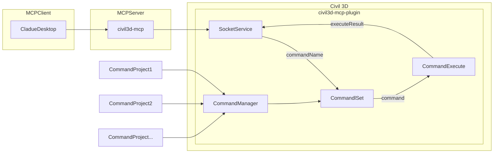

# civil3d-mcp

English

## Description

civil3d-mcp allows you to interact with Autodesk Civil 3D using the MCP protocol through MCP-supported clients (such as Claude, Cline, etc.).

This project is the server side (providing Tools to AI), and you need to use a Civil 3D MCP plugin (driving Civil 3D) in conjunction.

Join [Discord](https://discord.gg/cGzUGurq) | [QQ Group](http://qm.qq.com/cgi-bin/qm/qr?_wv=1027&k=kLnQiFVtYBytHm7R58KFoocd3mzU_9DR&authKey=fyXDOBmXP7FMkXAWjddWZumblxKJH7ZycYyLp40At3t9%2FOfSZyVO7zyYgIROgSHF&noverify=0&group_code=792379482)

## Features

- **150 MCP tools** covering the full Civil 3D design workflow
- Allow AI to read, create, modify, and delete Civil 3D objects
- Full road design pipeline: alignments, profiles, corridors, cross-sections, superelevation
- Surface analysis: elevation bands, slope distribution, aspect, watershed, cut/fill volumes
- Pipe and pressure network design and validation
- Plan production: sheet sets, Plan/Profile sheets, PDF export
- QC checks: alignment, profile, corridor, surface, pipe network, drawing standards
- Quantity takeoff: earthwork, corridor materials, pipe lengths, parcel areas, export to CSV
- Grading: feature lines, grading groups, grading criteria, surface generation
- Intersection design and corridor target mapping
- COGO/Survey: inverse, traverse, curve solve, survey figures
- Hydrology: flow path tracing, watershed delineation, Rational Method runoff

## Requirements

- nodejs 18+

> Complete installation environment still needs to consider the needs of the Civil 3D MCP plugin, please refer to its documentation.

## Installation

### 1. Build local MCP service

Install dependencies

```bash
npm install
```

Build

```bash
npm run build
```

### 2. Client configuration

**Claude client**

Claude client -> Settings > Developer > Edit Config > claude_desktop_config.json

```json
{
    "mcpServers": {
        "civil3d-mcp": {
            "command": "node",
            "args": ["<path to the built file>\\build\\index.js"]
        }
    }
}
```

Restart the Claude client. When you see the hammer icon, it means the connection to the MCP service is normal.


## Framework



## Supported Tools (150 total)

### Drawing Info & Context

| Tool | Description |
|------|-------------|
| `get_drawing_info` | Retrieves basic information about the active Civil 3D drawing |
| `list_civil_object_types` | Lists major Civil 3D object types present in the current drawing |
| `get_selected_civil_objects_info` | Gets properties of currently selected Civil 3D objects |
| `civil3d_health` | Reports Civil 3D connection and plugin status |
| `civil3d_drawing` | Manages drawing state, document info, save/undo operations |
| `civil3d_job` | Checks status of long-running async operations or requests cancellation |
| `list_tool_capabilities` | Lists domain and capability metadata for the full MCP tool catalog |

### Drawing Primitives

| Tool | Description |
|------|-------------|
| `create_cogo_point` | Creates a single COGO point |
| `create_line_segment` | Creates a simple line segment |
| `acad_create_polyline` | Creates an AutoCAD 2D polyline in model space |
| `acad_create_3dpolyline` | Creates an AutoCAD 3D polyline in model space |
| `acad_create_text` | Creates AutoCAD DBText in model space |
| `acad_create_mtext` | Creates AutoCAD MText in model space |

### Alignment (10 tools)

| Tool | Description |
|------|-------------|
| `civil3d_alignment` | Reads alignments, converts stationing, create/delete |
| `civil3d_alignment_report` | Builds structured alignment geometry report |
| `civil3d_alignment_get_station_offset` | Returns station/offset of an XY point relative to an alignment |
| `civil3d_alignment_add_tangent` | Appends a fixed tangent entity to an alignment |
| `civil3d_alignment_add_curve` | Appends a fixed horizontal curve to an alignment |
| `civil3d_alignment_add_spiral` | Appends a spiral (transition curve) to an alignment |
| `civil3d_alignment_delete_entity` | Deletes a tangent/curve/spiral entity by index |
| `civil3d_alignment_offset_create` | Creates a new offset alignment at a constant distance |
| `civil3d_alignment_set_station_equation` | Adds a station equation to an alignment |
| `civil3d_alignment_widen_transition` | Creates a variable-offset widening/narrowing transition region |

### Profile (10 tools)

| Tool | Description |
|------|-------------|
| `civil3d_profile` | Reads profiles, create/delete |
| `civil3d_profile_report` | Builds structured profile report with station/elevation sampling |
| `civil3d_profile_get_elevation` | Samples elevation and grade at a given station |
| `civil3d_profile_add_pvi` | Adds a PVI to a layout profile |
| `civil3d_profile_add_curve` | Adds a parabolic vertical curve at an existing PVI |
| `civil3d_profile_delete_pvi` | Deletes the PVI nearest to a specified station |
| `civil3d_profile_set_grade` | Sets the grade of a tangent entity |
| `civil3d_profile_check_k_values` | Validates K-values against AASHTO minimums for design speed |
| `civil3d_profile_view_create` | Creates a profile view at a specified insertion point |
| `civil3d_profile_view_band_set` | Applies a band set style to an existing profile view |

### Superelevation (4 tools)

| Tool | Description |
|------|-------------|
| `civil3d_superelevation_get` | Retrieve superelevation design data for an alignment |
| `civil3d_superelevation_set` | Apply superelevation using AASHTO attainment method |
| `civil3d_superelevation_design_check` | Validate max superelevation rates and attainment lengths |
| `civil3d_superelevation_report` | Generate formatted superelevation report |

### Surface (15 tools)

| Tool | Description |
|------|-------------|
| `civil3d_surface` | Reads surface data, create/delete |
| `civil3d_surface_edit` | Modifies surface data: points, breaklines, boundaries, contours |
| `civil3d_surface_statistics_get` | Comprehensive statistics: elevation range, area, point/triangle count |
| `civil3d_surface_contour_interval_set` | Set minor and major contour display intervals |
| `civil3d_surface_sample_elevations` | Sample elevations at grid points, discrete points, or transect |
| `civil3d_surface_analyze_elevation` | Elevation band distribution (area and percentage per band) |
| `civil3d_surface_analyze_slope` | Slope distribution (area and percentage per slope range) |
| `civil3d_surface_analyze_directions` | Aspect/facing direction breakdown by cardinal sectors |
| `civil3d_surface_volume_calculate` | Calculate cut/fill volumes between two surfaces |
| `civil3d_surface_volume_by_region` | Cut/fill volumes within a polygon region |
| `civil3d_surface_volume_report` | Formatted human-readable cut/fill volume report |
| `civil3d_surface_comparison_workflow` | Structured two-surface comparison with cut/fill volumes |
| `civil3d_surface_create_from_dem` | Create TIN surface from DEM file (.dem, .tif, .asc, .flt) |
| `civil3d_surface_watershed_add` | Add watershed analysis: drainage basins and flow paths |
| `civil3d_surface_drainage_workflow` | Surface drainage workflow: flow path, elevation sampling, runoff estimate |

### Corridor (6 tools)

| Tool | Description |
|------|-------------|
| `civil3d_corridor` | Reads corridor data, rebuild, volume operations |
| `civil3d_corridor_summary` | Builds corridor summary with surfaces and volume analysis |
| `civil3d_corridor_target_mapping_get` | Retrieve subassembly target mappings for a corridor |
| `civil3d_corridor_target_mapping_set` | Set/update subassembly target mappings (surfaces, alignments, profiles) |
| `civil3d_corridor_region_add` | Add a new region to a corridor baseline |
| `civil3d_corridor_region_delete` | Delete a region from a corridor baseline |

### Section & Section Views (6 tools)

| Tool | Description |
|------|-------------|
| `civil3d_section` | Reads section data, sample line creation |
| `civil3d_section_view_create` | Create section views for a sample line group |
| `civil3d_section_view_list` | List section views in the drawing |
| `civil3d_section_view_update_style` | Update display/band set style on existing section views |
| `civil3d_section_view_group_create` | Create a multi-row grid layout of section views |
| `civil3d_section_view_export` | Export section data to CSV/text (offsets, elevations, materials) |

### Intersection Design (3 tools)

| Tool | Description |
|------|-------------|
| `civil3d_intersection_list` | List all intersections in the drawing |
| `civil3d_intersection_create` | Create an intersection between two road alignments |
| `civil3d_intersection_get` | Get detailed properties of an intersection |

### Grading & Feature Lines (13 tools)

| Tool | Description |
|------|-------------|
| `civil3d_feature_line` | Reads feature lines, export as 3D polylines |
| `civil3d_feature_line_create` | Create a new feature line from 3D points |
| `civil3d_grading_group_list` | List all grading groups in the drawing |
| `civil3d_grading_group_create` | Create a new grading group |
| `civil3d_grading_group_get` | Get detailed info about a grading group |
| `civil3d_grading_group_delete` | Delete a grading group and all its gradings |
| `civil3d_grading_group_volume` | Get cut/fill volume report for a grading group |
| `civil3d_grading_group_surface_create` | Create a surface from a grading group |
| `civil3d_grading_criteria_list` | List all available grading criteria sets |
| `civil3d_grading_list` | List all grading objects within a grading group |
| `civil3d_grading_create` | Create a new grading from a feature line |
| `civil3d_grading_get` | Get detailed properties of a grading object |
| `civil3d_grading_delete` | Delete a grading object by handle |

### Points & Point Groups (6 tools)

| Tool | Description |
|------|-------------|
| `civil3d_point` | Reads, creates, imports, deletes COGO points and point groups |
| `civil3d_point_export` | Export COGO points to text/CSV (PNEZD, PENZ, XYZD, XYZ, CSV) |
| `civil3d_point_transform` | Transform points by translation, rotation, and/or scale |
| `civil3d_point_group_create` | Create a new point group with filter criteria |
| `civil3d_point_group_update` | Update filter criteria and description of a point group |
| `civil3d_point_group_delete` | Delete a point group (points are NOT deleted) |

### COGO & Survey (9 tools)

| Tool | Description |
|------|-------------|
| `civil3d_cogo_inverse` | Calculate bearing and distance between two coordinate pairs |
| `civil3d_cogo_direction_distance` | Project a point from start coordinate given bearing and distance |
| `civil3d_cogo_curve_solve` | Solve a horizontal curve given any two curve elements |
| `civil3d_cogo_traverse` | Solve a traverse from start point through bearing/distance courses |
| `civil3d_coordinate_system` | Coordinate system info and coordinate transformations |
| `civil3d_survey_database_list` | List all survey databases |
| `civil3d_survey_database_create` | Create a new survey database |
| `civil3d_survey_figure_list` | List all survey figures |
| `civil3d_survey_figure_get` | Get 3D vertex data for a specific survey figure |

### Pipe Networks — Gravity (3 tools)

| Tool | Description |
|------|-------------|
| `civil3d_pipe_catalog` | Lists available pipe parts lists and part names |
| `civil3d_pipe_network` | Reads pipe network data: networks, pipes, structures |
| `civil3d_pipe_network_edit` | Creates and modifies pipe networks, pipes, and structures |

### Pressure Networks (15 tools)

| Tool | Description |
|------|-------------|
| `civil3d_pressure_network_list` | List all pressure networks |
| `civil3d_pressure_network_create` | Create a new pressure network |
| `civil3d_pressure_network_get_info` | Get detailed info about a pressure network |
| `civil3d_pressure_network_delete` | Delete a pressure network and all components |
| `civil3d_pressure_network_assign_parts_list` | Assign a parts list to a network |
| `civil3d_pressure_network_set_cover` | Set minimum cover depth for pipes in a network |
| `civil3d_pressure_network_validate` | Validate a network for cover violations and disconnections |
| `civil3d_pressure_network_export` | Export pressure network data as structured JSON |
| `civil3d_pressure_network_connect` | Connect two pressure networks by merging |
| `civil3d_pressure_pipe_add` | Add a pressure pipe segment |
| `civil3d_pressure_pipe_get_properties` | Get properties of a pressure pipe |
| `civil3d_pressure_pipe_resize` | Change pressure pipe size to a different catalog entry |
| `civil3d_pressure_fitting_add` | Add a pressure fitting (elbow, tee, reducer, cap) |
| `civil3d_pressure_fitting_get_properties` | Get properties of a pressure fitting |
| `civil3d_pressure_appurtenance_add` | Add a pressure appurtenance (valve, hydrant, meter) |

### Plan Production / Sheets (12 tools)

| Tool | Description |
|------|-------------|
| `civil3d_sheet_set_list` | List all Plan Production sheet sets |
| `civil3d_sheet_set_create` | Create a new Plan Production sheet set |
| `civil3d_sheet_set_get_info` | Get detailed info about a sheet set |
| `civil3d_sheet_set_export` | Export all sheets to a multi-page PDF |
| `civil3d_sheet_set_title_block` | Set or update title block template on a sheet |
| `civil3d_sheet_add` | Add a new sheet to an existing sheet set |
| `civil3d_sheet_get_properties` | Get full properties of a specific sheet |
| `civil3d_sheet_publish_pdf` | Publish sheet layouts to a PDF file |
| `civil3d_sheet_view_create` | Create a viewport/view on a sheet layout |
| `civil3d_sheet_view_set_scale` | Update the scale of a viewport |
| `civil3d_plan_profile_sheet_create` | Create a Plan/Profile sheet for an alignment and profile |
| `civil3d_plan_profile_sheet_update_alignment` | Update alignment and/or profile on an existing sheet |

### QC Checks (8 tools)

| Tool | Description |
|------|-------------|
| `civil3d_qc_check_alignment` | QC alignment: tangent lengths, curve radii, spirals, design-speed compliance |
| `civil3d_qc_check_profile` | QC profile: max grade, K-values, sight distance requirements |
| `civil3d_qc_check_corridor` | QC corridor: invalid regions, missing targets, assembly gaps, rebuild errors |
| `civil3d_qc_check_pipe_network` | QC pipe network: cover depth, slope, velocity, connectivity |
| `civil3d_qc_check_surface` | QC TIN surface: elevation spikes, flat triangles, crossing breaklines |
| `civil3d_qc_check_labels` | Check labels for missing labels and style standard violations |
| `civil3d_qc_check_drawing_standards` | Audit drawing: layer naming, lineweights, colors |
| `civil3d_qc_report_generate` | Run full QC pass and write consolidated report to disk |

### Quantity Takeoff (10 tools)

| Tool | Description |
|------|-------------|
| `civil3d_qty_surface_volume` | Cut/fill volumes between surfaces (with corridor or region scope) |
| `civil3d_qty_earthwork_summary` | Running earthwork cut/fill summary table |
| `civil3d_qty_corridor_volumes` | Subassembly material volumes by region for a corridor |
| `civil3d_qty_material_list_get` | Retrieve material list defined on a corridor |
| `civil3d_qty_pipe_network_lengths` | Total pipe lengths for a gravity pipe network |
| `civil3d_qty_pressure_network_lengths` | Total pipe lengths for a pressure network |
| `civil3d_qty_alignment_lengths` | Total length for one or more alignments |
| `civil3d_qty_parcel_areas` | Area, perimeter, and address data for parcels |
| `civil3d_qty_point_count_by_group` | Count COGO points per point group |
| `civil3d_qty_export_to_csv` | Export consolidated quantity takeoff report to CSV |

### Hydrology (3 tools)

| Tool | Description |
|------|-------------|
| `civil3d_hydrology` | Hydrology analysis helpers and surface-based flow path tracing |
| `civil3d_surface_drainage_workflow` | Runs surface drainage workflow: flow path, elevations, runoff estimate |
| `civil3d_surface_watershed_add` | Add watershed analysis: drainage basins and flow paths |

### Miscellaneous (6 tools)

| Tool | Description |
|------|-------------|
| `civil3d_assembly` | Lists and inspects assemblies and subassemblies |
| `civil3d_label` | Manages labels on Civil 3D objects |
| `civil3d_style` | Lists and inspects Civil 3D styles |
| `civil3d_parcel` | Reads parcel and site data |
| `civil3d_data_shortcut` | Manages data shortcuts: listing, syncing, creating references |
| `civil3d_orchestrate` | Routes natural-language Civil 3D requests to the best tool |
